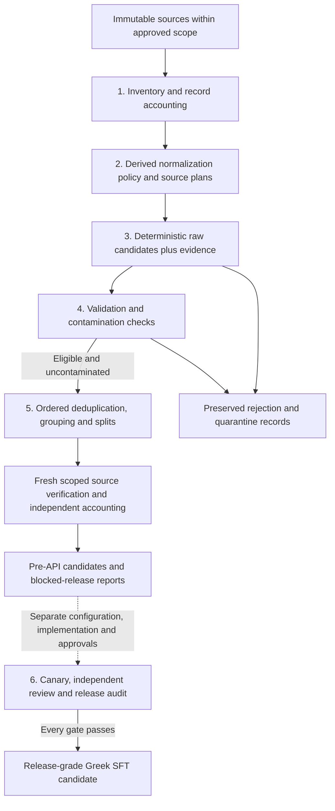

# Greek SFT pipeline: complete operating guide

This guide describes the implementation and the approved scope of run `20260907T095304Z_f315b3c9`, as documented on **8 September 2026**. The pipeline inventories an immutable corpus and constructs auditable, source-grounded Greek supervised fine-tuning candidates. It does not train a model. Deterministic construction, eligibility, independent review and release are separate steps.

The current run has produced **106,368 raw candidates**, all quarantined pending licensing and privacy resolution. Its five local checkpoints are complete; the current continuation reuses them and performs fresh source verification before final accounting. API review is disabled and there is no released training dataset. This dated description is not a live completion claim; use the inspection instructions below for current status.

## Contents

- [Scope and protections](#scope-and-protections)
- [Workflow and checkpoints](#workflow-and-checkpoints)
- [Pass 1: inventory](#pass-1-inventory)
- [Pass 2: cleaning policy and plans](#pass-2-cleaning-policy-and-plans)
- [Pass 3: candidate construction](#pass-3-candidate-construction)
- [Pass 4: validation and contamination](#pass-4-validation-and-contamination)
- [Pass 5: deduplication and splits](#pass-5-deduplication-and-splits)
- [Integrity, accounting and reuse](#integrity-accounting-and-reuse)
- [Pass 6: review and release](#pass-6-review-and-release)
- [Files and run layout](#files-and-run-layout)
- [Inspecting and resuming](#inspecting-and-resuming)
- [Dated run snapshot and remaining work](#dated-run-snapshot-and-remaining-work)
- [Implementation references](#implementation-references)

## Scope and protections

The immutable source directory is `/datadisk2/greekllm/GreekLLM_jsonl`. All pipeline code, generated text, temporary files, caches, logs and checkpoints belong under `/datadisk2/greekllm/GreekLLM_sft_pipeline`. Source files must never be rewritten, renamed, deleted, normalized in place, chmodded or executed. Output paths are canonicalized and symlink escapes rejected. Source readers reject symlinks and use read-only regular-file handles; `O_NOATIME` is used where permitted, with an ordinary read-only fallback on permission failure.

Two **exact top-level roots** are excluded from both SFT generation and current source coverage:

- `greek_training/`, which the user identified as a mixture of other collections.
- `greek_training_temp/`, excluded by the subsequent recorded continuation instruction.

Neither excluded directory is opened or traversed by the approved continuation. Similar names and unrelated paths are not excluded by this decision. Exclusion changes processing scope; it does not alter the source files. Broader derived-artifact classifications in configuration are separate from these two authorized current-coverage exclusions.

Earlier integrity incidents remain preserved. The original baseline has not been replaced, and historical excluded counts do not describe current excluded contents. Successful verification means integrity of the **remaining approved scope**; full-original-tree integrity remains failed. The separately checksummed amendment chain records how the scope evolved and is validated on resume. The effective scope SHA-256 is `528d36547869818b2298a365e731c9fb147ef180c409d89e17fcabac91801d59`.

The [pipeline settings](configs/pipeline.yaml) specify seed `1729`, four workers, batches of `1000`, maximum record size `32 MiB` and maximum JSON size `64 MiB`. Network access is disabled for normal processing. Frozen run configuration and versioned scope amendments govern reuse; editing a setting does not authorize silently rebuilding an old checkpoint.

## Workflow and checkpoints



| Pass | Input and main operation | Durable checkpoint or output |
|---|---|---|
| 1 | Source files → inventory, byte hashes, formats, records and risks | `checkpoint_01_inventory` |
| 2 | Inventory and catalog → source-specific task plans and dispositions | `checkpoint_02_source_plans` |
| 3 | Accepted plans and source records → deterministic candidates and evidence | `checkpoint_03_raw_candidates` |
| 4 | Raw candidates and evidence → validated/quarantined partitions and contamination results | `checkpoint_04_validated_candidates` |
| 5 | Clean validated candidates → deduplication, grouped splits, fertility and integrity check | `checkpoint_05_dedup_splits` |
| 6 | Separately approved pre-API candidates → independent review and gated release audit | Review artifacts and `release/`; no sixth checkpoint |

A completed checkpoint preserves data, accounting, statistics, errors, configuration identity, manifests and checksums. Progress and heartbeat files are advisory. Completion is established by durable artifacts and their checks, not by a progress counter alone.

## Pass 1: inventory

The inventory records original file paths, byte sizes, SHA-256 hashes, encoding/format observations, source families, identifiable record counts, schemas and provenance/risk screens. Unsupported files and operational artifacts remain visible in accounting rather than disappearing because they cannot generate candidates.

The implemented record readers cover `.jsonl`, `.jsonl.zst` and `.qjsonl.zst`; `.json`, `.meta` and `.idx` use whole-JSON-document accounting, with array length reported separately where applicable. Other formats remain opaque/unresolved rather than receiving an implied generic CSV, Parquet or gzip parser. JSONL accounting includes every physical row, including blank and malformed rows. SQLite record ranges cover consecutive original records and preserve commitments to their hashes. JSON containers use documented document-level accounting units. When binary or unsupported formats do not provide reliable record boundaries, those boundaries remain **unresolved**; a zero candidate count is not a claim that the file contains zero records.

Compressed input is checked as encoded bytes and, when recognized as compressed JSONL, through payload decoding. Explicit Zstandard frame checks catch truncated tails that a streaming decoder can otherwise overlook. Concatenated and skippable frames are supported. Framing failures retain the original byte hash and identified rows while recording processing errors and unresolved boundaries. Older inventory results without the required framing-check version cannot be silently trusted.

Workers commit finished scans durably. Small-file inventory commits batch up to 256 files by default, while files at least 64 MiB trigger immediate commits. SQLite retains full synchronous durability. An interruption can therefore require rereading uncommitted work, including up to 255 completed small files per worker and its current file.

The inventory audit reconciles files and record ranges and separately reports byte-identical source files from saved hashes and sizes. This duplicate inventory does not establish semantic document duplication. Unsafe paths, source changes and incompatible checkpoint identities stop processing. Inventory parse/framing problems remain accounted with error status. The explicit 1% deterministic-failure stop is enforced after Pass 4.

Implementation: [inventory](src/greek_sft/inventory.py), [source readers](src/greek_sft/source_io.py), [Zstandard checks](src/greek_sft/zstd_integrity.py), [inventory audit](src/greek_sft/audit.py).

## Pass 2: cleaning policy and plans

The second pass consumes the inventory and source catalog and writes versioned per-family plans plus file dispositions. There are **77 catalog family plans**, but only five implemented task adapters. Other families are marked `needs_adapter`, `manual_design` or `blocked` with specific reasons. Such labels describe the present implementation and unresolved evidence, not a general judgment that those collections cannot support useful SFT tasks.

Cleaning is derived: Unicode NFC, line-ending normalization and outer-whitespace normalization are applied when constructing evidence and examples. Original files remain untouched. OCR repair is disabled. Any future approved selective repair must be versioned, logged and placed before deduplication; the pipeline does not apply global OCR rewriting or relabel ancient/dialectal material as modern native Greek.

Plans define exact required fields, permitted annotations, grouping identities, prompt templates, answer reconstruction rules and rejection criteria. Unsupported schemas, missing grounding, model-predicted labels without verified semantics and unresolved source-specific task design prevent acceptance. Licensing and privacy uncertainty are retained as eligibility restrictions even where internal candidate construction is allowed. Scope mismatches, changed plan/checkpoint artifacts or unsafe source identities stop reuse.

The five adapters in task specification version `1.1.0` are:

| Source family | Input → answer | Main restrictions |
|---|---|---|
| `skroutz_shop_reviews_sentiment_analysis` | Whole `text` → `Positive`/`Negative` mapped to `θετική`/`αρνητική` | At least 50 characters; documented labels only; annotation leakage rejected |
| `recipes` | `name`, whole `Ingredients`, whole `Instructions` → existing `Category` | Four documented categories; no inferred quantities, dietary claims or comma splitting |
| `modern-greek-dictionary` | `lemma`, whole entry `text` → short pronunciation sentence | Pronunciation must be 1–64 characters and exactly match the first bracketed span |
| `AMNA-press` | `title`, whole plain-text `text` → existing `category` | Six categories; body at least 160 characters; numeric article ID must match AMNA URL |
| `Photodentro_all_documents` | `title`, whole description `text` → JSON thematic-area and educational-level lists | Description at least 120 characters; verified object URL; permitted levels; complete hierarchy strings and array order retained |

Classification answers copy source annotations; they are not independently certified judgments. There is no generic summarization, invented question-answer generation, teacher-model generation or example inflation by echoing arbitrary text. See [source plans](configs/sources/README.md) and [task implementation](src/greek_sft/tasks.py).

## Pass 3: candidate construction

Generation streams only files accepted by compatible plans and current scope checks. Required fields must be complete and unambiguous. Input fields exceeding the default **20,000-character** limit are rejected rather than truncated. Greek text must meet the configured `0.70` Greek-letter ratio, contain at least 15 Greek characters and contain Greek accents. Risk screening includes evidence and grouping fields as well as prompt text.

Each accepted record produces at most one candidate for these adapters. Source-family workers own separate shards; batch journals and per-record dispositions support recovery. Full file hashes and record counts are checked against inventory during generation. A source hash or record-count mismatch stops the pass.

The [canonical schema](schemas/canonical-sft.schema.json) requires `id`, exactly three `messages` in `system`, `user`, `assistant` order, and metadata. Metadata preserves `language: el`, `locale: el-GR`, source name and relative path, record ID/hash, task, generation method/version, template version, split group, validation/review status and `grounded: true`. Generated records also carry source-file hashes, line numbers, domain, grounding span and license/privacy status.

Evidence is a separate record keyed by example ID and candidate hash. It contains the exact required fields used to reconstruct the prompt and answer, original lineage hashes, normalization policy and rights/privacy evidence. This supports validation without treating arbitrary source text as an instruction. Rejected records and their reason codes remain in `rejected.jsonl` and record dispositions. “Accepted” at generation means an internal candidate was constructed; it does not mean permission to train, disclose or release it.

## Pass 4: validation and contamination

Validation reads raw candidates and evidence and writes new artifacts. Raw candidates remain immutable. Checks include canonical schema, identity and lineage, exact deterministic reconstruction of prompt/answer, grounding, language, annotation rules, privacy and licensing. A candidate that reconstructs perfectly can still be quarantined because its license or privacy review is unresolved.

The processing-error stop threshold is **greater than 1%**. Expected policy-only quarantines are excluded from that processing-failure calculation. This allows honest accounting to finish while keeping ineligible examples out of downstream training material. Greek-ratio/accent screens and regex PII/secret detection are heuristics; they do not establish grammar, naturalness, comprehensive privacy clearance or legal rights.

Contamination comparison receives **validated candidates only**. Local GreekMMLU and configured private references are fingerprinted and compared through exact questions, substrings and an 80% five-word-shingle containment test. Short exact matches are conservatively quarantined and require manual audit. Clean and contaminated partitions are preserved. Lexical checks cannot prove absence of semantic paraphrases.

The normal pipeline does not download evaluation datasets. A separate [public evaluation fetch script](scripts/fetch_public_evaluation.py) exists for that preparation, preserving revision/file evidence. Evaluation material is used for comparison, never as training input. Private paths are currently empty and evaluation coverage is not user-confirmed, so complete contamination clearance remains unavailable even if local comparisons finish.

Outputs include `validated.jsonl`, quarantined data, validation statistics, `contamination_report.json` and the contamination partitions. Schema/content errors receive reasons; excessive processing errors or artifact mismatches stop the pass, while unresolved rights/privacy and contamination prevent eligibility. See [validation](src/greek_sft/tasks.py) and [contamination](src/greek_sft/contamination.py).

## Pass 5: deduplication and splits

Only clean, validated candidates enter this pass. Its preserved stage order is **ExactSubstrings → MinhashDedup → SentenceDedup**, followed by grouping, balancing and splitting. Every removal preserves the original example and its keeper relationship; the algorithms remove whole records. Comparison text combines the valid user grounding span, when present, with the assistant answer; otherwise it uses the whole user message and answer. The system prompt is excluded. Deduplication comparison text uses NFC, casefolding and whitespace collapse; this comparison normalization is separate from candidate construction and does not rewrite preserved records.

1. **ExactSubstrings:** detects exact content hashes and whole-content containment. Substring comparison uses a minimum of 240 characters and 32-character anchors.
2. **MinhashDedup:** proposes pairs only when normalized comparison text is at least 240 characters and has nonempty five-word shingles, using 64 permutations and eight bands. Removal requires exact Jaccard similarity at least `0.90`, plus matching answer, numbers and task. Approximate hashing alone does not authorize removal.
3. **SentenceDedup:** requires total normalized comparison text of at least the configured 80 characters; the code fallback is 240 if omitted. This is not a minimum for each sentence. All nonempty sentence segments, including short ones, enter a normalized set. At least two distinct sentences are required, and all must occur in one keeper. It does not delete individual sentences from a surviving example.

The candidate-pair cap is 5,000,000; exceeding bounded processing limits stops work. Removal above 20% sets a high-removal warning. Separately, any removal in a protected domain (`legal`, `religious`, `academic`, `historical`, `educational`) requires manual over-deduplication auditing. Settings, stage results and removal provenance are retained.

Grouping combines declared `split_group`, source-file/record lineage and near-duplicate connected components. Near-group construction and leakage checking use exhaustive prefix-filtered Jaccard comparisons rather than relying only on MinHash proposals. Balancing applies domain caps after deduplication to whole groups; current caps are empty (`{}`). Seeded assignment targets train/validation/test proportions of **90%/5%/5%**, but indivisible groups can prevent exact percentages. Large source-file groups can strongly affect the achievable balance.

Each split has rich `canonical.jsonl` and a separate `messages.jsonl` export containing messages only. These live under `completed/pre_api/` and remain pre-API candidates. No trainer-specific template, token packing or model training is performed.

Fertility uses the local Gemma tokenizer at `/datadisk2/greekllm/models/google_gemma-4-E2B-it`, read-only and without downloads or remote code. Assets/package versions are fingerprinted. Source-derived text is encoded without special tokens, truncation or padding. Mean fertility is **total tokens / total Unicode word matches**, not an average of per-example ratios. Values above `3.0` block packing and require investigation. Packing remains disabled even below that threshold; no vocabulary extension occurs. Missing tokenizer evidence is unresolved, while an empty candidate set is `not_applicable` and proves no tokenizer adequacy.

Fresh source verification follows deduplication. Dedup/checkpoint identity failures, leakage failures and source verification failures prevent successful completion or release. See [deduplication and split implementation](src/greek_sft/dedup.py).

## Integrity, accounting and reuse

Source verification checks the original in-scope baseline against current regular files, including changed, added and removed files. It does not rebaseline differences. Both excluded roots remain outside traversal. A resumed completed Pass 5 still triggers a **fresh** verifier in a unique attempt directory.

The latest scope change preserved completed Passes 1–4 and added an external, checksummed scope reconciliation. It proves that accepted file dispositions and raw candidates refer to neither excluded root, recomputes historical scope totals, and checks candidate/evidence lineage and validation partitions. Historical checkpoint identities remain distinct from the effective scope identity. A saved reconciliation is revalidated before reuse.

The driver holds an exclusive run lock and snapshots code/configuration/tests for each execution attempt. Completed artifacts and configuration identities are checked before reuse. Interrupted attempts, previous states and integrity incidents are retained. A changed configuration generally requires a new run or an explicitly designed versioned continuation; removing completion markers or editing frozen files is not a supported recovery method.

After local Pass 5, the driver estimates review volume, writes blocked-release reports, runs independent accounting and prepares a canary proposal. The audit reconciles files, record dispositions, candidate hashes, partitions, split outputs, scope and source verification. Accounting success does not override licensing, privacy, review or evaluation gates. A report may therefore show consistent accounting and a blocked release simultaneously.

## Pass 6: review and release

Pass 6 is a separately gated workflow. **The current CLI does not execute API review or release when given `--through 6`; it raises `Pass6ApprovalRequired`, including after configuration changes.** The existing [review engine](src/greek_sft/review.py) accepts an injected transport, but no live provider adapter is configured. Connecting that workflow is future implementation work as well as an approval step.

[Reviewer configuration](configs/reviewer.yaml) currently disables review and external candidate/evidence transmission. Provider, protocol, URL, model, credential environment-variable name, request rate, concurrency, timeouts, retries and token/monetary budgets are unset. A configured environment-variable name is not a credential value; secrets must not be placed in documentation, tracked configuration or logs.

The intended sequence is: estimate volume and cost; configure an approved transport and external-data permissions; select a stratified canary of at most **30 exact approved candidate hashes**; compare independent decisions with approved manual gold; require at least **0.90 decision agreement** with complete gold coverage; then obtain separate approval for full review. Canary approval cannot authorize additional examples or the full dataset. The estimate uses an approximate character-based token model and must not be mistaken for an exact provider bill.

The [Greek review rubric](prompts/review/rubric_v1.txt) scores correctness, grounding, instruction adherence, naturalness, completeness, safety/privacy and educational value from 0–4. Responses must satisfy the [review schema](schemas/api-review.schema.json). Acceptance requires all seven scores to be at least 3, an empty issue list and no proposed revision. Invalid, failed or missing responses never count as acceptance. The engine includes hash-keyed cache validation, durable budget reservation, bounded concurrency, rate limiting, timeout propagation and retry backoff.

A proposed revision creates a preserved version changing only the assistant response, resets validation/review and requires both again. Original text and review history remain available. A release requires all technical gates, accepted review coverage, source integrity, licensing/privacy clearance and evaluation coverage. Even then, the deliverable is called a **release-grade Greek SFT candidate** until final human and legal approval.

## Files and run layout

Paths below are relative to this project. Some directories are created only when their stage is reached; the tree is a navigation map, not a claim that approved release data exists.

```text
configs/                         Pipeline, reviewer and source-plan configuration
schemas/                         Canonical candidate and API review schemas
prompts/                         Versioned generation/review specifications
src/greek_sft/                    Processing, integrity, review and accounting code
scripts/                         Driver, status and evaluation preparation
runs/20260907T095304Z_f315b3c9/
  state.json                     Advisory persisted run state
  events.jsonl                   Stage/attempt events
  execution_attempts/            Per-attempt code/configuration snapshots
  checkpoint_01_inventory/       Source manifest and record accounting
  checkpoint_02_source_plans/    Plans and file dispositions
  checkpoint_03_raw_candidates/ Candidate/evidence shards and journals
  checkpoint_04_validated_candidates/
                                 Validation and contamination partitions
  checkpoint_05_dedup_splits/
    completed/                   Preserved dedup stages and pre_api splits
    source_verification/         Initial verification attempts
  source_verifications/          Fresh verification on checkpoint reuse
  source_scope_amendments/       Separately frozen scope changes
  scope_reconciliations/         Effective-scope reuse/accounting proofs
  integrity_incidents/           Preserved failures and evidence
  execution_failures/            Failed-attempt state and diagnostics
  continuation_checkpoints/     Handoffs, launch metadata and driver logs
  audits/                        Inventory and duplicate-file accounting
  api_review_plan.json          Local volume/budget estimate
  review/                        Canary preparation and future review artifacts
  release/                       Gated reports, manifests and audit results
```

Release layout includes canonical/train/validation/test/quarantined locations and provenance, license, quality, contamination and reproduction reports. An existing `release/` directory or `LATEST_AUDIT.json` does not itself establish an approved release.

## Inspecting and resuming

Run inspection from the project directory:

```bash
cd /datadisk2/greekllm/GreekLLM_sft_pipeline
python3 -B scripts/status.py --run-id 20260907T095304Z_f315b3c9 --compact
```

The [status script](scripts/status.py) reads run artifacts and read-only inventory databases, not source text. Its inventory counters and persisted state may lag the fresh verifier or final audit. Consult the [current handoff](runs/20260907T095304Z_f315b3c9/continuation_checkpoints/20260908T092504Z_0f378a77_reporting_lookup/RUNNING.md), [launch record](runs/20260907T095304Z_f315b3c9/continuation_checkpoints/20260908T092504Z_0f378a77_reporting_lookup/launch.json), driver log and the latest verifier's `progress.json`/`source_integrity.json` where present. Counters advance at reporting boundaries, so a large file can make progress appear stationary.

Before restarting, verify process identity. This read-only check compares the launch PID with Linux process start ticks, avoiding PID-reuse confusion:

```bash
python3 -B - <<'PY'
import json
from pathlib import Path
launch = Path('runs/20260907T095304Z_f315b3c9/continuation_checkpoints/'
              '20260908T092504Z_0f378a77_reporting_lookup/launch.json')
info = json.loads(launch.read_text())
try:
    fields = Path(f'/proc/{info["pid"]}/stat').read_text().rsplit(')', 1)[1].split()
except FileNotFoundError:
    print('Recorded process is absent; inspect final state before deciding to resume.')
else:
    same = int(fields[19]) == info['process_start_ticks']
    print('Recorded process still exists: do not start a duplicate.' if same
          else 'PID belongs to another process; inspect final state and newer launches.')
PY
```

This checks the recorded launch, not every possible later launch. If the job has finished normally, inspect its final status and blockers; do not rerun merely to keep it active. If it stopped before completing the authorized work, inspect errors and ensure no other orchestrator is active. Then resume the same frozen run:

```bash
python3 -B scripts/run_pipeline.py \
  --run-id 20260907T095304Z_f315b3c9 \
  --through 5
```

Do not use `--new-run` for continuation. Do not start a duplicate process, erase failure evidence, replace hashes or edit completed checkpoints to bypass a stop. On an in-scope source change, stop and investigate. The current launch uses `nohup`, a separate process session and redirected logs, allowing client disconnection while the server and process remain running. The foreground resume command above does not itself create a detached session.

## Dated run snapshot and remaining work

The continuation launched at **2026-09-08 09:30:56 UTC**, recorded as PID `3972284` with start ticks `396885998`. It reused all five completed checkpoints and started mandatory fresh verification under `source_verifications/resume_a37ebc2ffe534b8b86ff5164ff0d9ede/attempt_hqhbp6ko`. This guide does not assert that this attempt has completed.

| Historical baseline accounting | Files | Bytes | Identified records |
|---|---:|---:|---:|
| Original inventory | 1,056,912 | 362,152,306,789 | 20,666,996 |
| Both excluded roots | 2,978 | 16,718,428,975 | 3,957,620 |
| Remaining approved scope | 1,053,934 | 345,433,877,814 | 16,709,376 |

There are **84 in-scope files with unresolved record boundaries**. Current excluded contents/counts are unknown. These numbers are historical reconciled inventory totals, not a new scan of the excluded roots.

| Raw candidate family | Candidates |
|---|---:|
| AMNA-press | 45,833 |
| Photodentro_all_documents | 5,086 |
| modern-greek-dictionary | 44,617 |
| recipes | 5,434 |
| skroutz_shop_reviews_sentiment_analysis | 5,398 |
| **Total** | **106,368** |

All 106,368 passed deterministic schema/content checks but remain quarantined. `license_unverified` and `privacy_review_unresolved` each apply to 106,368 candidates; reason counts overlap. Validated, clean, dedup-input, API-ready and released counts are all zero. Completion of deduplication on an empty eligible set provides no evidence about eventual corpus quality, split balance or fertility.

Remaining work is to finish fresh integrity verification and final accounting; establish source-specific licensing/privacy evidence; design and implement additional adapters where appropriate; confirm evaluation/private benchmark coverage; then configure, implement and separately approve independent review. Changes affecting frozen candidate eligibility require a deliberate versioned run workflow. No model-training setup, packing or vocabulary modification is part of this local continuation.

## Implementation references

For exact behavior, consult the [driver](scripts/run_pipeline.py), [core durability and checkpoint helpers](src/greek_sft/core.py), [scope validation](src/greek_sft/source_scope.py), [scope reconciliation](src/greek_sft/scope_reconciliation.py), [fresh integrity verifier](src/greek_sft/integrity.py), [independent reporting audit](src/greek_sft/reporting.py) and [project instructions](AGENTS.md). The [tests directory](tests/) contains synthetic-data coverage for processing, source protection, scope changes, resume behavior, reporting, deduplication and review gates. Documentation inspection does not execute the pipeline or modify its source corpus.
